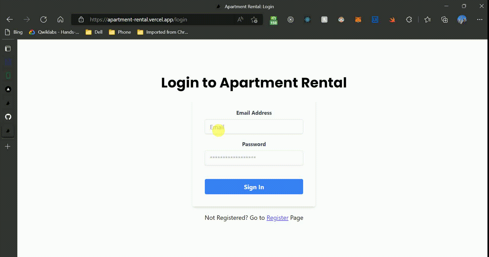

# Project Overview

[Deployment Url](https://apartment-rental.vercel.app/)

This App is created with Frontend on React and Backend on Node. For Auth and Database purposes, Firebase Cloud is used. (Firebase Auth and Firestore). For deployment Vercel is used.

For Global State management, Redux Toolkit is used and for simplifying the styles tailwind is used. The states that are not supposed to be globally shared have been handled in a local reducer whereas auth data is handled in the global reducer.

## Frontend Details

All the Frontend Components can be found in [components](components/) directory. This contains the pages and respective components.

Routing is handled via file based routing and all the routes can be found in [pages](pages/) folder. [api](pages/api/) folder contains all the routing logic for backend APIs.

In total we have 4 routes:

- homepage [You can navigate to register and login from here]
- login [To log user in]
- register [To register for a new account]
- profile [This is a compound route consisting of three sub routes.]

[constants](constants/) contains the routes that are used along with the immediate state variables and their logic. Immediate states are the states that are not required to be shared among different components.

All the frontend API Data Fetching logics and interfaces can also be found there.

Lib contains all sorts of utility that's being used in frontend and backend. I have used a middleware to intercept all the authenticated requests and compare the JWT token coming from the client to verify and authenticate end user. The logic can be found [here.](lib/backend/middleware/withUserProtect.ts).

Other than this one can find response synthesizing utilities in [responsehandlers](lib/backend/responsehandlers)

Similarly api utilities can be found in [apis](lib/backend/apis).

We have used just one slice to manage user auth state which is distributed throughout the [app](redux/slices/posts.ts).
